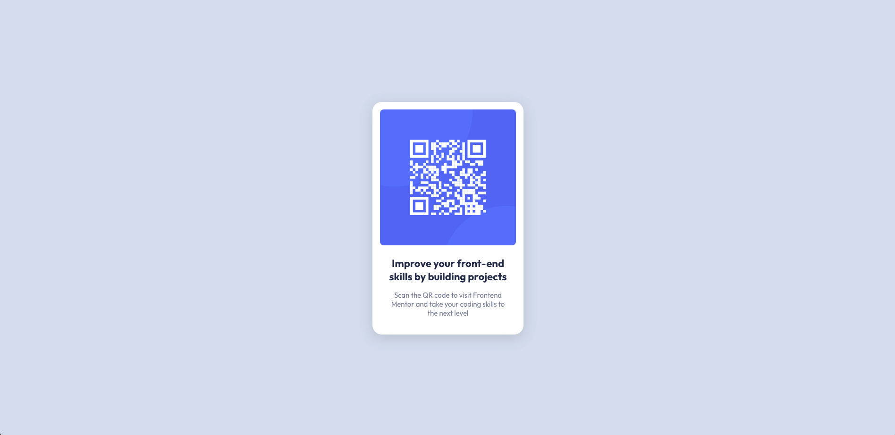

# Frontend Mentor - QR code component solution

## Table of contents

- [Overview](#overview)
  - [Disclaimer](#disclaimer)
  - [Screenshot](#screenshot)
  - [Links](#links)
- [My process](#my-process)
  - [Built with](#built-with)

## Overview

### Disclaimer

I want to acknowledge that I have removed several sections from this README.md for the following reason: English is not my native language, and I may have difficulty expressing my thoughts and ideas accurately in writing.

I apologize for any inconvenience this may cause, and I appreciate your understanding. If you have any questions or need further clarification on any part of this project, please don't hesitate to reach out. I'm more than willing to provide additional information and assistance to ensure a better understanding of the content.

If you have any suggestions or resources that you think might be helpful for improving my skills, please feel free to address them. Your input and support are highly valued.

### Screenshot

### Links

- Solution URL: [Github](https://github.com/acorriaz/qr-code-flexbox)
- Live Site URL: [GitHub Pages](https://acorriaz.github.io/qr-code-flexbox/)

## My process

### Built with

- Flexbox
